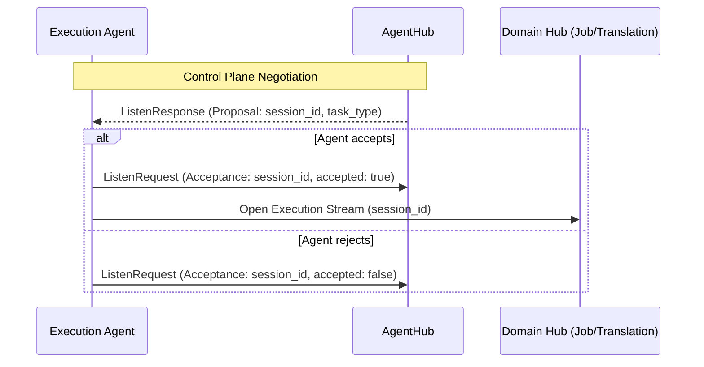
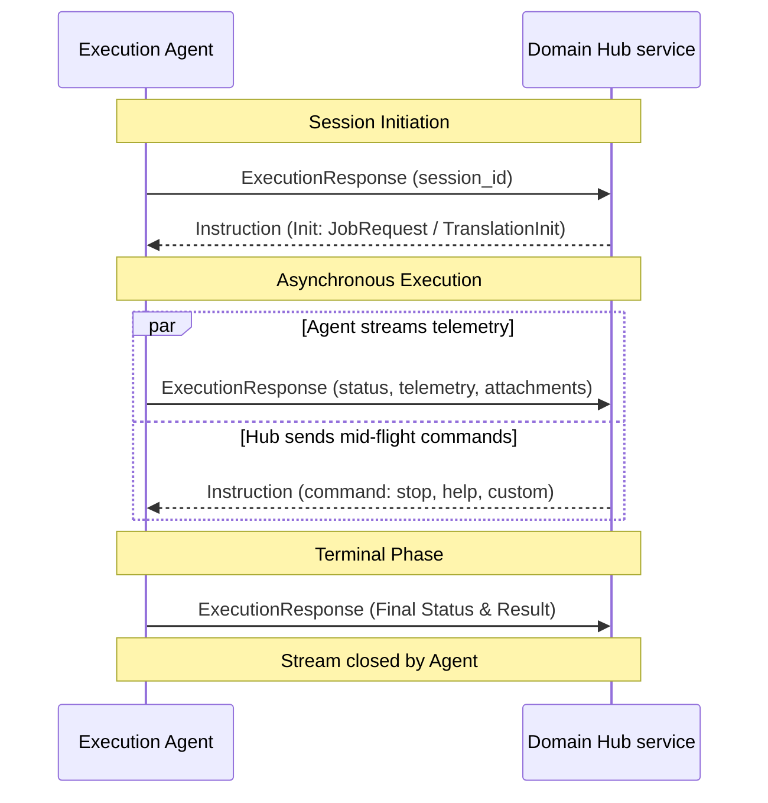

# Universal Agent Protocol (UAP) - v1

This document defines the communication workflow and architecture of the **Universal Agent Protocol (UAP)**. The protocol is designed to enable a centralized **Hub (CMS)** to orchestrate a distributed fleet of **Execution Agents** using a unified control plane and domain-specific execution streams.

UAP adheres to a **1-1-1 Modular Pattern**, where every individual message, enum, and service is defined in its own isolated `.proto` file for maximum clarity and extensibility.

---

## 1. Core Architecture: Unified Control Plane

UAP separates its operations into two distinct planes to ensure high performance and isolated session management:

1.  **Unified Control Plane (`AgentHub`)**: A single service for agent identity, registration, capability discovery, and session negotiation. Agents maintain one persistent connection for all domains.
2.  **Domain Execution Planes (`JobHub`, `TranslationHub`)**: Task-specific services for high-throughput, session-isolated execution of test jobs or script translations.

---

## 2. Control Plane Handshake: The Two-Step Sequence

To ensure secure session identity and efficient multiplexing, Agents follow a two-step handshake on the `AgentHub`.

### Step 1: Agent Registration
The Agent performs a unary **`Register`** call to identify itself and its capabilities.

### Step 2: The Listen Stream
The Agent establishes a long-lived, bi-directional **`Listen`** stream. This stream handles all capability domains concurrently.

> [!IMPORTANT]
> **Identity via Headers**: The Agent MUST provide its assigned `client_id` in the `x-client-id` GRPCRPC header for every `Listen` call. Identification is NOT handled within the stream's payload.

---

## 3. Negotiated Scheduling: Proposal and Acceptance

UAP uses a negotiated scheduling model (Server-Initiated) to ensure efficient work distribution. The Hub queries an Agent's readiness before finalizing a session assignment.

### Protocol Interaction Flow:
1.  **Proposal**: The Hub sends a **`JobProposal`** or **`TranslationProposal`** via the `Listen` stream.
2.  **Acceptance**: The Agent responds with a **`JobAcceptance`** or **`TranslationAcceptance`**.
3.  **Initiation**: Upon acceptance, the Agent opens a dedicated bi-directional execution stream (e.g., `Execute` or `Translate`) on the relevant Domain Hub.

---

## 4. Execution Plane Workflow: Multi-Step Isolation

Execution sessions are highly isolated, short-lived, and multi-plexed through instruction and response events.

---

## 5. Lifecycle & Connectivity

### Availability Management
UAP relies on native GRPCRPC transport health signals. An Agent is considered **Available** as long as its `Listen` stream to the `AgentHub` remains open. Legacy heartbeat pulses have been removed in favor of GRPCRPC keep-alives.

### Graceful Shutdown
The Hub signals a graceful shutdown to an Agent by simply **closing the `Listen` response stream**. Upon stream closure, the Agent should complete any active execution sessions and shut down safely.

### Reconnection Strategy
If a connection is severed, the Agent **MUST** attempt to re-connect using an exponential backoff strategy:
1.  **Initial delay**: 1 second.
2.  **Maximum delay**: 60 seconds.
3.  **Backoff multiplier**: 2x.

Agents may attempt to re-establish the `Listen` stream using their existing `client_id` for session recovery if supported by the Hub implementation.
