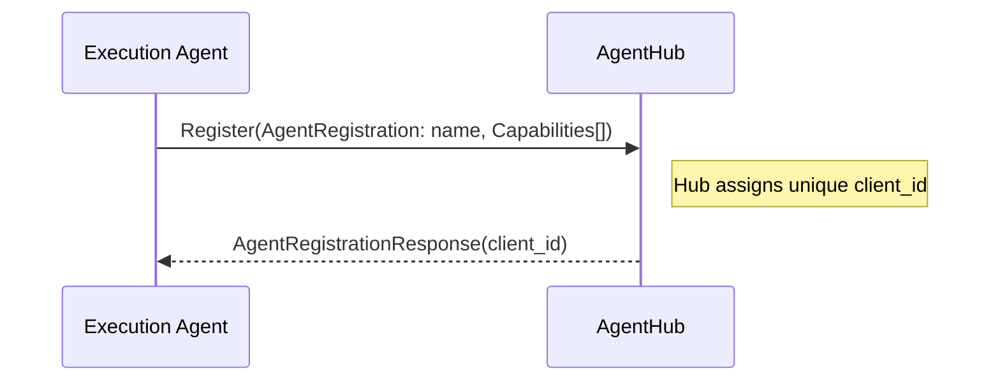
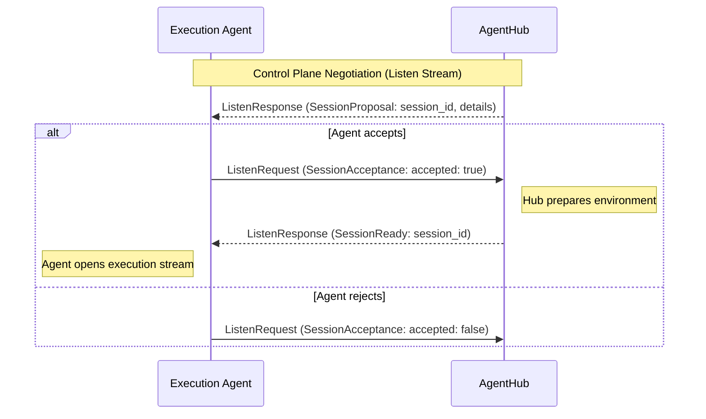
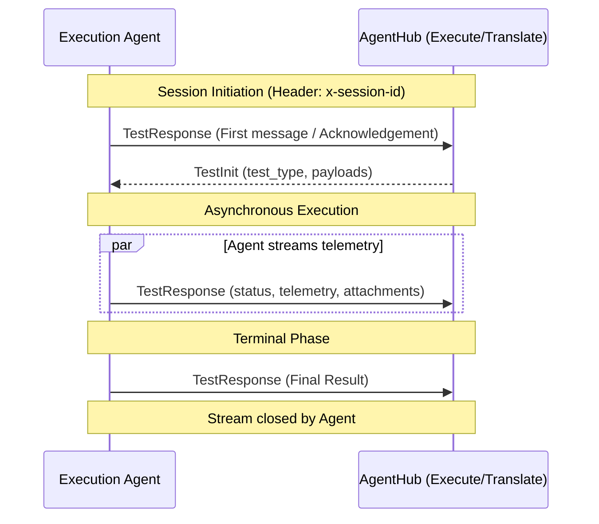

# Universal Agent Protocol (UAP) - v1

This document defines the communication workflow and architecture of the **Universal Agent Protocol (UAP)**. The protocol is designed to enable a centralized **Hub (CMS)** to orchestrate a distributed fleet of **Execution Agents** using a unified control plane and domain-specific execution streams.

UAP adheres to a **1-1-1 Modular Pattern**, where every individual message, enum, and service is defined in its own isolated `.proto` file for maximum clarity and extensibility.

---

## 1. Core Architecture: Unified Control Plane

UAP separates its operations into two distinct logical planes to ensure high performance and isolated session management, while maintaining a single entry point:

1.  **Unified Control Plane**: Handled via the `Register` and `Listen` RPCs on the `AgentHub` service. This plane manages agent identity, capability discovery, and session negotiation.
2.  **Execution Plane**: Handled via domain-specific RPCs (`Execute` for tests, `Translate` for script conversion) on the same `AgentHub` service. These use dedicated streams to ensure session isolation.

---

## 2. Control Plane Handshake: The Two-Step Sequence

To ensure secure session identity and efficient multiplexing, Agents follow a two-step handshake on the `AgentHub`.

### Step 1: Agent Registration
The Agent performs a unary **`Register`** call to identify itself and its capabilities.

### Step 2: The Listen Stream
The Agent establishes a long-lived, bi-directional **`Listen`** stream. This stream is the primary conduit for session proposals and control signals.

> [!IMPORTANT]
> **Identity via Headers**:
> - **Control Plane (`Listen`)**: The Agent MUST provide its assigned `client_id` in the `x-client-id` header.
> - **Execution Plane (`Execute`, `Translate`)**: The Agent MUST provide the `session_id` in the `x-session-id` header.
>
> Identification is handled via gRPC metadata (headers) rather than message payloads to optimize performance and separation of concerns.

---

## 3. Negotiated Scheduling: Proposal and Acceptance

UAP uses a negotiated scheduling model to ensure efficient work distribution. The Hub queries an Agent's readiness before finalizing a session assignment.

---

## 4. Execution Plane Workflow: Session-Isolated Streams

Once a session is "Ready", the Agent opens a dedicated bi-directional stream for that specific task.

---

## 5. Lifecycle & Connectivity

### Availability Management
UAP relies on native gRPC transport health signals. An Agent is considered **Available** as long as its `Listen` stream to the `AgentHub` remains open.

### Reconnection Strategy
If a connection is severed, the Agent **MUST** attempt to re-connect using an exponential backoff strategy:
1.  **Initial delay**: 1 second.
2.  **Maximum delay**: 60 seconds.
3.  **Backoff multiplier**: 2x.

Agents should re-register upon reconnection to obtain a fresh `client_id`, unless session resumption is explicitly supported by the implementation.
