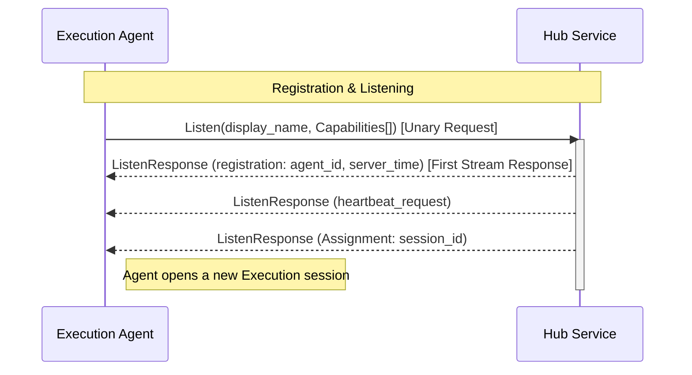
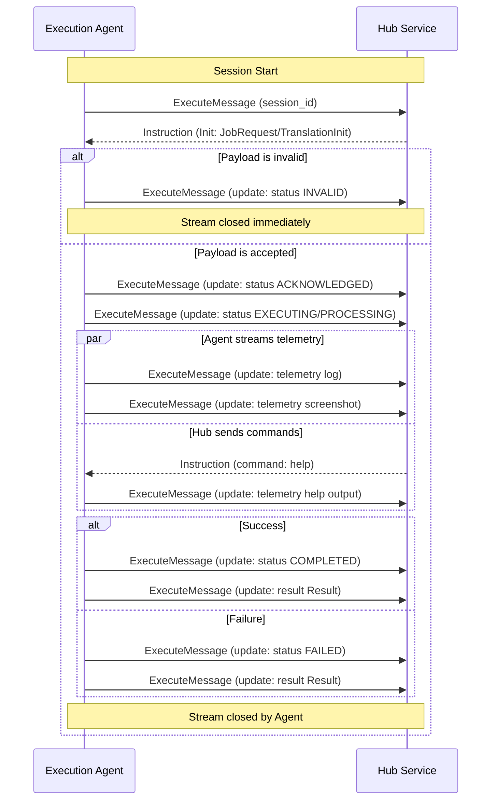

# Universal Agent Protocol (UAP) - v1

This document defines the communication workflow and architecture of the **Universal Agent Protocol (UAP)**. The protocol is designed to enable a centralized **Hub (CMS)** to orchestrate a distributed fleet of **Execution Agents** within a private enterprise network.

## 1. Core Architecture: Split Services

To ensure independence and flexibility, UAP splits its functionality into two distinct services:
- **`JobHub`**: Handles test job execution workflows.
- **`TranslationHub`**: Handles script translation workflows.

An Agent connects as a client to either or both of these Hub services depending on its capabilities.

### Control vs. Execution Planes
Within each service, the protocol is split into two logical planes:
1.  **Control Plane**: A long-lived, server-streaming connection (`Listen`) for agent registration, heartbeats, and instruction dispatch.
2.  **Execution Plane**: Ephemeral, dedicated bi-directional streams for running specific test jobs (`Execute`) or translations (`Translate`).

---

## 2. Control Plane Lifecycle (Service-Specific)

The following sequence diagram illustrates the Agent's registration and listening lifecycle. This pattern is identical for both `JobHub` and `TranslationHub`.

### Step 1: Registration
The Agent initiates a `Listen` call. The request contains its **display name** and its specific **Capabilities** (e.g., `TestCapability` for `JobHub`, `TranslationCapability` for `TranslationHub`).

### Step 2: Listening for Work
The Hub immediately sends a `RegistrationResponse` as the first message on the stream, followed by `ListenResponse` directives:
- **`Assignment`**: Contains a `session_id`. The Agent should open a new Execution session (Execute/Translate).
- **`heartbeat_request`**: A connectivity check.

---

## 3. Execution Plane Workflow (Service-Specific)

Each session runs as a **dedicated bi-directional stream**, fully isolated from the Control Plane.

---

## 4. Connectivity & Error Handling

### Reconnection Strategy
If a `Listen` stream is severed, the Agent **MUST** attempt to reconnect using exponential backoff:
1. Initial delay: 1 second.
2. Maximum delay: 60 seconds.
3. Backoff multiplier: 2x.

### Session Correlation
The `session_id` from an `Assignment` directive **MUST** be sent as the **first message** in the corresponding Execution stream. The Hub waits for this first message to correlate the worker stream with the original directive before sending the initialization instruction.
