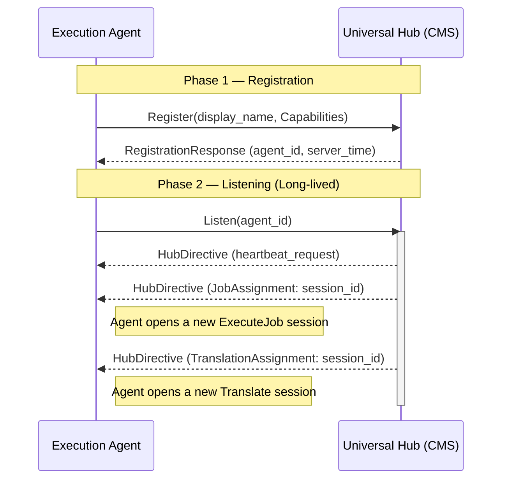
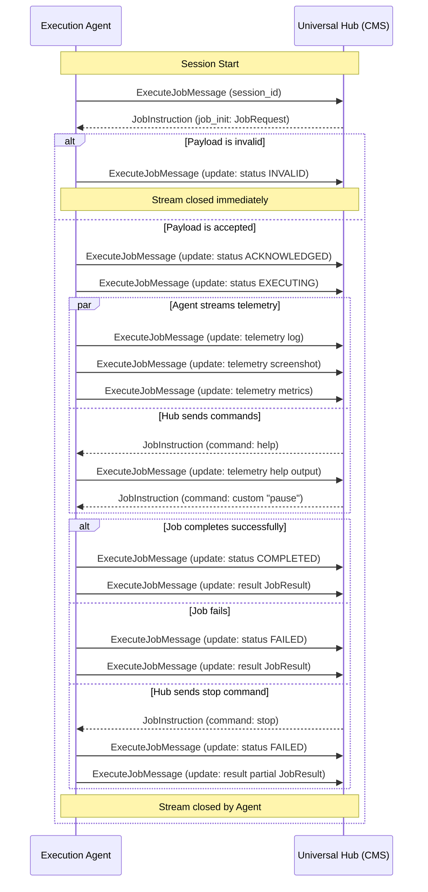
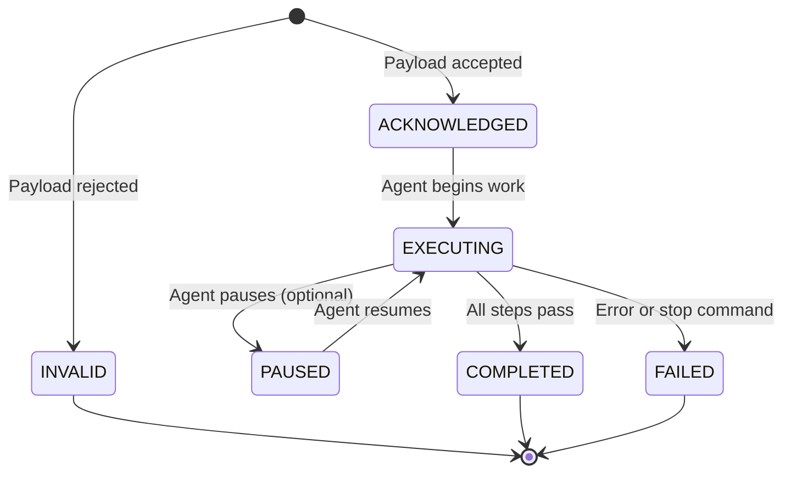
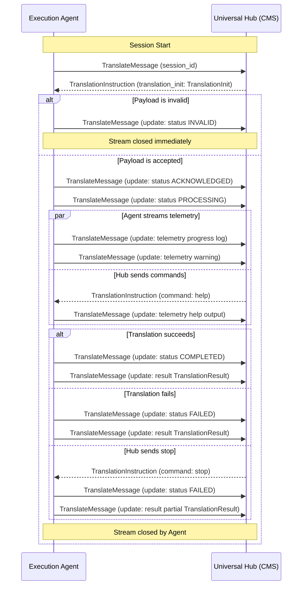
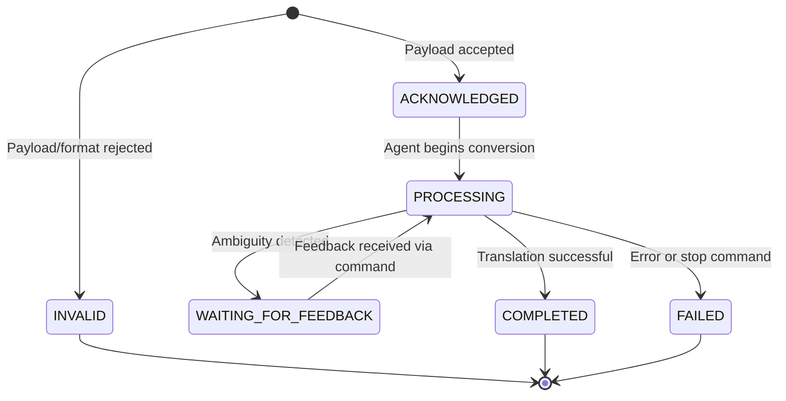

# Universal Agent Protocol (UAP) - v1

This document defines the communication workflow and architecture of the **Universal Agent Protocol (UAP)**. The protocol is designed to enable a centralized **Hub (CMS)** to orchestrate a distributed fleet of **Execution Agents** within a private enterprise network.

## 1. Core Architecture: The Passive Agent Model

To ensure seamless operation within corporate firewalls and NAT environments, UAP follows a **Passive Agent** model:
- **Agent as Client**: The Execution Agent initiates all network connections.
- **Hub as Server**: The Management Plane (CMS) hosts the gRPC services and holds the state of the network.

### Control vs. Execution Planes
The protocol is split into two logical planes to ensure isolation and robustness:
1.  **Control Plane**: A long-lived, stable connection for agent discovery, heartbeats, and instruction dispatch.
2.  **Execution Plane**: Ephemeral, dedicated sessions for running specific test jobs or translations. Each session is a **separate gRPC stream**, fully isolated from the Control Plane and from other sessions.

---

## 2. Control Plane Lifecycle

The following sequence diagram illustrates the Agent's registration and listening lifecycle.

### Step 1: Registration
Upon startup, the Agent calls the `Register` unary RPC with a `RegistrationRequest` containing its **display name** (a human-readable identifier) and its list of **Capabilities** (test types it can run, translation pairs it supports). The Hub assigns a unique `agent_id` and returns the current server time for clock synchronization.

### Step 2: Listening for Work
The Agent establishes a long-lived `Listen` server-streaming RPC. It remains idle while waiting for `HubDirective` messages:
- **`JobAssignment`**: Contains a `session_id`. The Agent should open a new `ExecuteJob` session.
- **`TranslationAssignment`**: Contains a `session_id`. The Agent should open a new `Translate` session.
- **`heartbeat_request`**: A connectivity check. The Agent should remain connected.

> **Note**: The `Listen` stream is **never closed** under normal operation. If it disconnects, the Agent must reconnect with exponential backoff.

---

## 3. Job Execution Workflow

Each test job runs as a **dedicated bi-directional stream** (`ExecuteJob`), fully isolated from the Control Plane.

### Detailed Steps

1. **Session Start**: The Agent receives a `JobAssignment` from the `Listen` stream. It opens a new `ExecuteJob` bi-directional stream and sends the `session_id` as the **first `ExecuteJobMessage`**. The Hub uses this to correlate the worker stream with the original directive.

2. **Initialization**: The Hub sends a `JobInstruction` containing the `JobRequest` (runtime environment + payload).

3. **Validation**: The Agent inspects the payload.
   - If the payload type is unsupported or malformed, the Agent sends `JobStatus(INVALID)` and closes the stream.
   - If accepted, the Agent sends `JobStatus(ACKNOWLEDGED)` followed by `JobStatus(EXECUTING)`.

4. **Interactive Execution**: While the job is running (all Agent messages are `ExecuteJobMessage` with the `update` field):
   - **Agent → Hub**: Streams `Telemetry` messages (logs, screenshots, metrics) and `JobStatus` updates.
   - **Hub → Agent**: May send `JobCommand` messages (`help`, `stop`, or custom commands).

5. **Completion**: When the job finishes:
   - The Agent sends a terminal `JobStatus` (`COMPLETED` or `FAILED`).
   - The Agent sends the final `JobResult` containing step-by-step reports, logs, and a summary.
   - The Agent closes the stream.

### Job Status State Machine

### JobResult Structure

When the job ends, the `JobResult` contains:
- **`status`**: The terminal `JobStatus` (COMPLETED or FAILED).
- **`steps`**: A list of `StepReport` entries, each with a step name and its own `JobStatus`.
- **`logs`**: Global log lines collected during execution.
- **`summary`**: An optional structured data object for custom metrics.

---

## 4. Translation Workflow

Each translation runs as a **dedicated bi-directional stream** (`Translate`), following the same session isolation pattern as jobs.

### Detailed Steps

1. **Session Start**: The Agent receives a `TranslationAssignment` from the `Listen` stream. It opens a new `Translate` bi-directional stream and sends the `session_id` as the **first `TranslateMessage`**. The Hub uses this to correlate the worker stream with the original directive.

2. **Initialization**: The Hub sends a `TranslationInstruction` containing the `TranslationInit` (target format + source payload). The source format is inferred from the payload's `type` field.

3. **Validation**: The Agent inspects the payload and target format.
   - If the combination is unsupported, the Agent sends `TranslationStatus(INVALID)` and closes the stream.
   - If accepted, the Agent sends `TranslationStatus(ACKNOWLEDGED)` followed by `TranslationStatus(PROCESSING)`.

4. **Interactive Translation**: While processing (all Agent messages are `TranslateMessage` with the `update` field):
   - **Agent → Hub**: Streams `Telemetry` messages (progress logs, warnings, or partial outputs).
   - **Hub → Agent**: May send `TranslationCommand` messages (`help`, `stop`, or custom commands).
   - The Agent may send `TranslationStatus(WAITING_FOR_FEEDBACK)` if it needs user input to resolve ambiguities.

5. **Completion**: When the translation finishes:
   - The Agent sends a terminal `TranslationStatus` (`COMPLETED` or `FAILED`).
   - The Agent sends the final `TranslationResult` containing the translated payload, status, and a translation log.
   - The Agent closes the stream.

### Translation Status State Machine

### TranslationResult Structure

When the translation ends, the `TranslationResult` contains:
- **`status`**: The terminal `TranslationStatus` (COMPLETED or FAILED).
- **`translated_payload`**: A `Payload` object containing the converted script in the target format.
- **`translation_log`**: A human-readable log of the conversion process, including any warnings or skipped elements.

---

## 5. Mandatory Commands

Every UAP-compliant Agent **MUST** implement the following built-in commands within **both** `ExecuteJob` and `Translate` sessions:

| Command | Description |
| :--- | :--- |
| `help` | Returns a list of all available commands (built-in and custom) via a `Telemetry` message. |
| `stop` | Forcefully terminates the current session. The Agent must send a terminal status and partial result before closing. |

Custom commands are sent as plain strings. The Agent should respond to unrecognized commands with a `Telemetry` message indicating the command is not supported.

---

## 6. Telemetry

During any active session, the Agent provides real-time feedback through `Telemetry` messages embedded in the response stream.

### Telemetry Fields

| Field | Type | Description |
| :--- | :--- | :--- |
| `message` | `string` | The primary log line or human-readable output. |
| `extra` | `oneof` | Either `metadata` (structured `Struct`) or `blob` (raw `bytes`). |
| `extra_type` | `string` | Identifies the content. For `blob`: a MIME type (e.g., `"image/png"`). For `metadata`: a schema name (e.g., `"metric"`, `"error-details"`). |

### Common Telemetry Patterns

| Pattern | `extra_type` | `extra` | Description |
| :--- | :--- | :--- | :--- |
| Log line | _(empty)_ | _(empty)_ | Simple text log. |
| Screenshot | `"image/png"` | `blob` | Browser screenshot as PNG bytes. |
| Error details | `"error-details"` | `metadata` | Structured error with stack trace, element info, etc. |
| Performance | `"metric"` | `metadata` | Key-value pairs for timing, memory, etc. |
| Help output | `"help"` | `metadata` | Map of command names to descriptions. |

---

## 7. Connectivity & Error Handling

### Heartbeats
The Hub may periodically send a `heartbeat_request` through the `Listen` stream to verify Agent connectivity.

### Reconnection Strategy
If the `Listen` stream is severed, the Agent **MUST** attempt to reconnect using exponential backoff:
1. Initial delay: 1 second.
2. Maximum delay: 60 seconds.
3. Backoff multiplier: 2x.

### Orphan Sessions
If an `ExecuteJob` or `Translate` stream disconnects unexpectedly:
- The **Agent** should attempt to gracefully stop execution and clean up resources.
- The **Hub** should mark the session as `FAILED` with a timeout-based error after a configurable grace period.

### Session Correlation
The `session_id` from the `JobAssignment` or `TranslationAssignment` directive **MUST** be sent as the **first message** in the corresponding `ExecuteJob` or `Translate` stream (via `ExecuteJobMessage.session_id` or `TranslateMessage.session_id`). The Hub waits for this first message to correlate the worker stream with the original directive before sending the initialization instruction.
